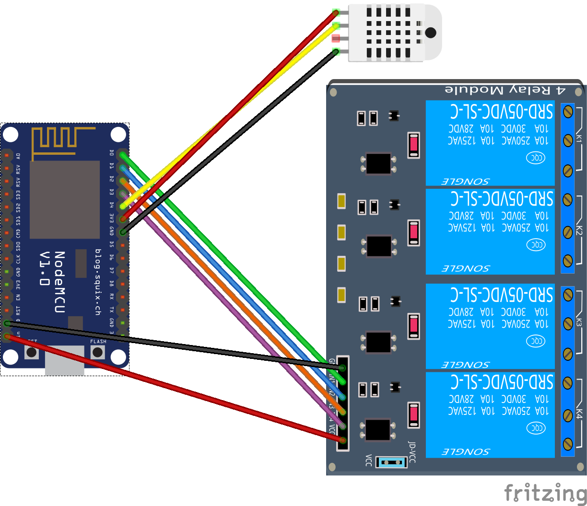

# ESP8266 House Thermostat

This is a stand alone house thermostat for controlling the furnace, a/c, fan, and house humidifier.  Controls are access through a web server (either on local wifi network or an access point).  There is also MQTT integration for use with Home Assistant (https://www.home-assistant.io/).

### Why did I do this?

I have been using Home Assistant lately and love it.  My main dislike was that I had to use 2 generic thermostats to control my heating and cooling.  The other issue is that I run my Home Assistant on a raspberry pi...which is prone to sd card failure.  So what happens if my Home Assistant goes down....I don't have any control over the temperature anymore.  That is why I created this thermostat.  It'll continue to work and I'll have access to it even if Home Assistant or my router dies.  But Crewski, why not just get a Nest or some other connected thermostat?  Simple, temperatures throughout the house.  I wanted to be able to tell my thermostat what the temperature was.  I use this for at night when all I care about is the bedroom temperatures that are upstairs....not whatever it is in the living room.

### Arduino Libraries

* ESPAsyncWebServer (https://github.com/me-no-dev/ESPAsyncWebServer)
  * I found this library to be awesome.  It provides a super fast webserver....way better than the ESP8266WebServer I initially tried
* ESPAsyncTCP (https://github.com/me-no-dev/ESPAsyncTCP) required by the ESPAsyncWebServer
* DHT22 (https://github.com/adafruit/DHT-sensor-library) available from the Arduino library manager
* Adafruit Unified Sensor (https://github.com/adafruit/Adafruit_Sensor) required by DHT22 library, also available from Arduino library manager


### Items needed

* NODEMCU v1.0 or equivalent (not compatible with Wemos D1 Mini due to GPIO nomenclature)
* DHT22 (mine already has the pull-up resistor in place)
* 4-channel relay board
* 5v power supply
* Jumper wires

### Wiring

I hooked up the DHT22 to 3.3v and the relay module to 5v.  I may switch the DHT22 to 5v as well depending on how well it functions.

<p align="center"></p>

### Connectivity

Upon the first boot (or whenever it can't connect), the device will broadcast its own access point.  It'll be named HVAC-12345678 (different numbers).  Connect to it and then go to 192.168.4.1 on your browser.  From there, you can click on the "Connectivity" button to input your wifi/mqtt credentials.  After saving, the device will reboot and try to connect.  You should be able to connect via it's IP address on you wifi.

### MQTT

There are several command topics and 3 response topics for the device.  MQTT topics follow the pattern:

```
cmnd/%TOPIC_NAME%/%command%
resp/%TOPIC_NAME%/%response%
```
Below are the command topics available.

| COMMAND | DESCRIPTION |
|------------------|-------------------------------------------------------------------------------------------------|
| status | Send empty payload to receive status. |
| targettemp | Set the current target temp.  Temp will be saved into appropriate variable (Heat/cool/away/etc) |
| temp | Set the current temp.  If none is provided, the local DHT22 will be used after timeout. |
| humidity | Set the current humidity.  If none is provided, the local DHT22 will be used after timeout. |
| targethumidity | Set the humidity target. |
| mode | Set the mode.  Values are "off", "heat", and "cool". |
| fan | Set the fan mode.  Values are "auto" and "on". |
| away | Put the HVAC into away mode.  Away heat or Away cool temp target used. |
| hold | Put the HVAC into hold mode. |
| humidifier | Activates humidifier function (only runs when heat is running) |
| relay/heat | Turn on heat relay (may immediately turn off by running code). |
| relay/cool | Turn on cool relay (may immediately turn off by running code). |
| relay/fan | Turn on fan relay (may immediately turn off by running code). |
| relay/humidifier | Turn on humidifier relay (may immediately turn off by running code). |

To set the target temperature, send the following:
```
Topic: cmnd/HVAC/targettemp
Payload: 70
```

Here are the 3 responses.

| RESPONSE | DESCRIPTION |
|----------|-------------------------------------------------------------------------------|
| status | Gives operational status including modes, set points, and current conditions. |
| relay | Gives the status of the 4 relays (heat, cool, fan, humidifier) |
| sensor | Gives the temperature and humidity of the connected DHT22 |

An example status response looks like:
```
{"target_temp":76,"temp":70.7,"target_humidity":40,"humidity":34.1,"mode":"cool","fan":"auto","away":false,"hold":false,"humidifier":false}
```


## Authors

* **Crewski** - *Initial work* - (https://github.com/Crewski)


